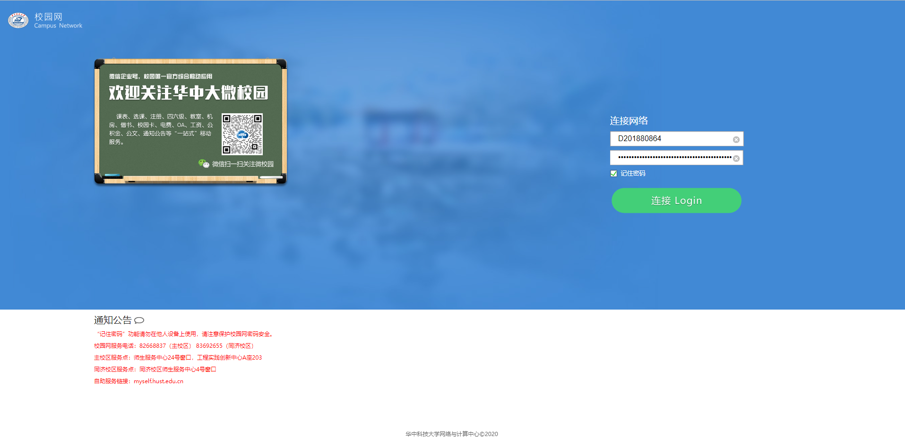
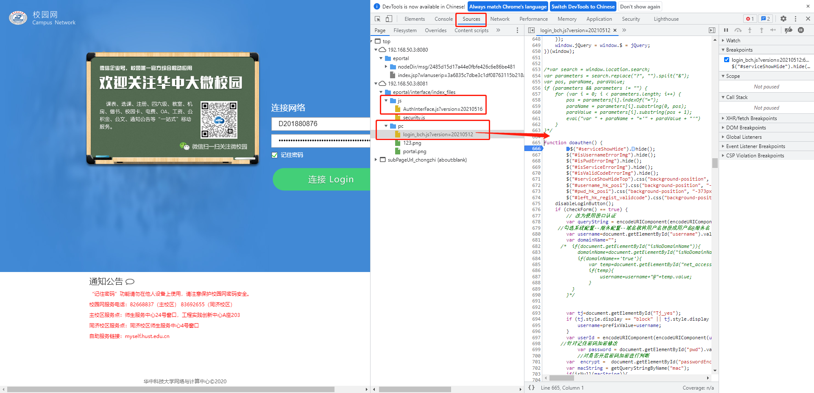
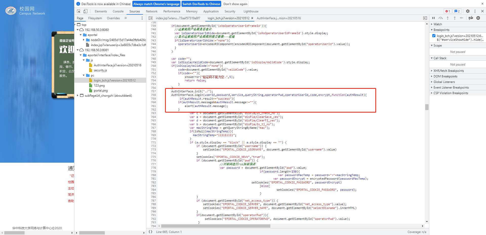
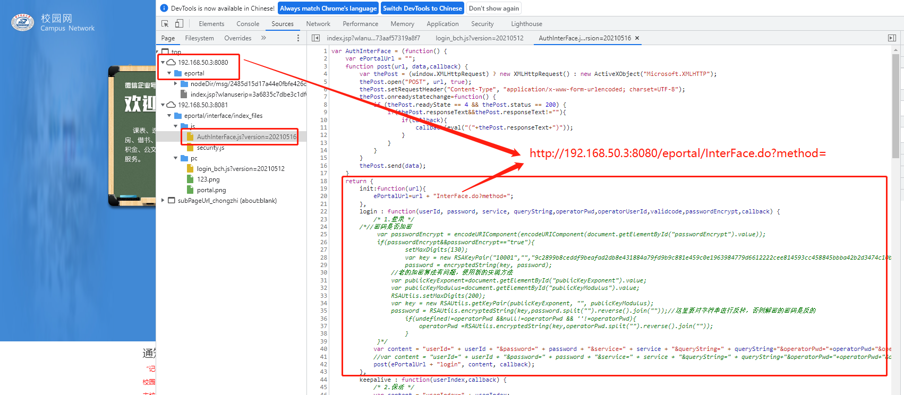

## 前言

寝室安装了一个路由器, 但是不知道什么原因, 每天都会断开连接, 需要手动认证一下才可以, 
为了避免不必要的麻烦, 写了这样一个小的python脚本来自动的重连

本文设计的操作有一定的上手难度, 不太适合对计算机完全不懂的同学使用, 如有需求, 可私聊

## 源码解析

主函数非常的简单:
```python
if __name__ == '__main__':
    while True:
        if pong():
            time.sleep(5)
        else:
            login()
            time.sleep(10)
```
每个5秒检查自己还能不能上网, 方式就是`ping 8.8.8.8`, 这是很常见的方法.

如果不能上网, 那么就调用`login()`函数来自动重连

我们的校园网认证的过程,本质上就是提交一个HTTP请求, 那我们的`login()`函数, 其实就是实现了这个过程, 因此我们只需要直到,我们的网页端认证
是怎么操作的即可,麻烦的是华科的校园网的代码设计的还是很复杂的,所以还是稍微的耗费了一点时间.

## 校园网认证流程
首先我们进入这个认证的页面, 按F12进入开发者模式



我们会在Source中看到两个重要的JS文件,当我们点击网页中的`连接 Login`的时候就会调用这个函数.



这个函数会收集你的一系列信息,并最终调用:`AuthInterFace.login`



`AuthInterFace`定义在 `AuthInterFace.js`中.

其中`init()`用于生成请求的url, `login()`首先将传入的参数合并成`content`,最后通过post方法发送请求



因此需要我们做的就是, 获取`content`的内容, 然后我们就可以用python对指定的url发起post请求

获取content的方法也很简单, 只需要在如图位置打上断点, 然后点击网页中连接的按钮,当js执行到断点后,就可以复制content的值


## 使用

0. git clone https://github.com/Kingdo777/auto-connect-school-network.git


1. 我们将上一过程获取到的content信息存放到main.py的同目录下的名为`content`的文件中


2. 然后就可以执行python脚本了


3. 不过windows下需要安装npcap, 可以点击以下链接下载安装
   
   https://nmap.org/npcap/dist/npcap-1.60.exe

## 后记

1. 如果切换了Wifi, 导致IP地址改变, 那么需要重新获取content的值. 